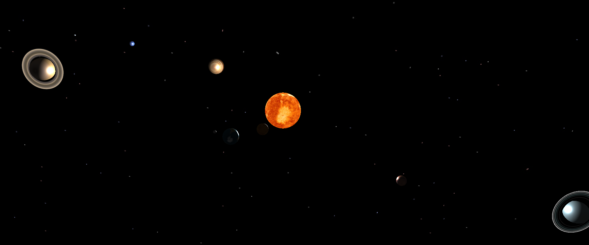

# Solar System Simulation with Three.js 🌌🪐

This project is a 3D simulation of the solar system using Three.js. You can explore the solar system by moving your mouse to navigate through space and zoom in on planets. It's a fun and educational way to learn about our celestial neighbors! 🚀🌠



## Installation 📦

Follow these steps to get the project up and running on your local machine:

1. **Clone the Repository**: Start by cloning this GitHub repository to your computer. Open your terminal and run the following command:

   ```bash
   git clone https://github.com/mesropaghumyan/solar-system.git
   ```

2. **Navigate to the Project Folder**: Change your current directory to the project's folder:

   ```bash
   cd solar-system
   ```

3. **Install Dependencies**: Use npm (Node Package Manager) to install the required dependencies:

   ```bash
   npm install
   ```

   or

   ```bash
   bun install
   ```

4. **Run the Development Server**: Start a local server to view the project in your web browser. This command will also watch for changes and automatically reload the page:

   ```bash
   npm run vite
   ```

   or

   ```bash
   bun run vite
   ```

5. **Open in Your Browser**: Once the development server is running, open your web browser and go to `http://localhost:5173` to see the solar system simulation in action. 

## Usage 🚀

- **Mouse Movement**: Move your mouse to control the camera's orientation and explore the solar system.
- **Zoom In/Out**: Use the scroll wheel on your mouse to zoom in and out.

## Credits 🙌

This project uses the following technologies and libraries:

- [Three.js](https://threejs.org/): A popular 3D graphics library for creating interactive 3D experiences in the browser.
- [NASA Solar System Data](https://solarsystem.nasa.gov/planets/overview/): Planetary data and textures provided by NASA.

## Contributing 🤝

If you'd like to contribute to this project, please follow these steps:

1. Fork the repository on GitHub.
2. Clone your fork to your local machine.
3. Create a new branch for your feature or bug fix: `git checkout -b feature-name`.
4. Make your changes and commit them with descriptive commit messages.
5. Push your branch to your fork on GitHub: `git push origin feature-name`.
6. Create a Pull Request (PR) from your fork on GitHub to the main repository. 🛠️🔧
